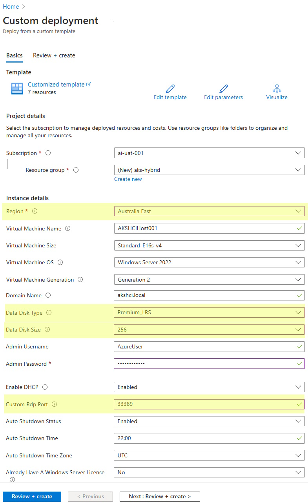
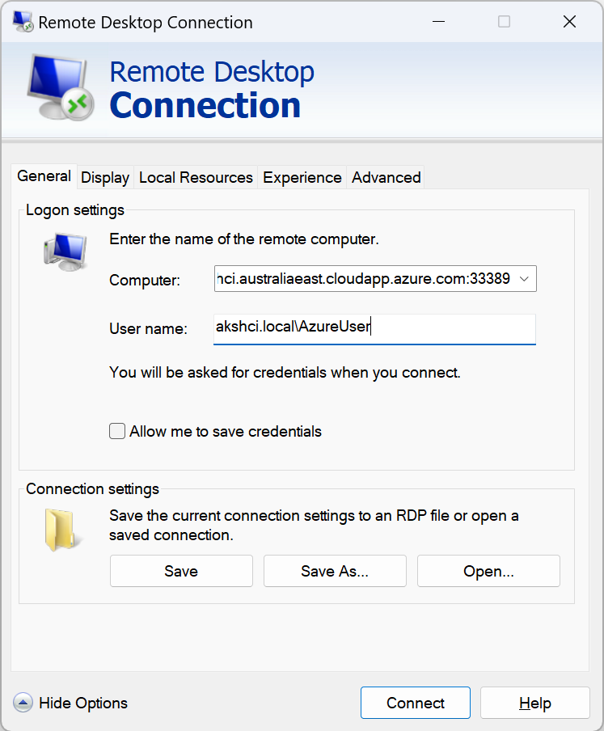

# Working with NTLM and Kerberos application using AKS Hybrid, and Azure Arc-enabled data service

1. Introduction
1. Prepare an Azure Virtual Machine for AKS hybrid evaluation
    1. Deploy a VM in Azure to host AKS Hybrid using Windows Server Hyper-V
1. Creating an Active Directory domain
    1. Create a new Domain and Domain controller to support NTLM and Kerberoes authentication
1. Setting up AKS Hybrid cluster
    1. Deploy AKS Hybrid
    1. Create AKS Hybrid Workload Cluster
    1. Deploy Windows Node Pool for the .Net application
    1. Deploy Linux Node Pool for SQL Managed Instance
    1. Connecting and managing the AKS Hybrid Workload Cluster
1. Setting up Azure Arc-enabled SQL Managed Instance
    1. Deploy Azure Arc-enabled data service data controller
        1. Deploy Azure Arc-enabled data service direct connectivity mode
    1. Deploy Arc-enabled SQL Managed Instance with Active Directory integration
        1. Azure Arc-enabled SQL Managed Instance with Active Directory authentication
        1. Deploy Arc-enabled SQL Managed Instance using Active Directory authentication
1. Deploy .Net App that use NTLM authentication
    1. Application explanation
    1. Configuring gMSA for Windows Containers
    1. Authentication between WebApp using NTLM to access Arc-enabled SQL Managed Instance

## 1. Introduction

The need for this comprehensive guide arises from the increasing demand for infrastructure modernization of legacy applications leveraging AKS Hybrid to orchestrate the application infrastructure. Many businesses today rely on a hybrid environment that spans both on-premises and cloud infrastructure. This hybrid setup brings its own set of challenges, especially when it comes to security, single sign on (SSO), seamless integration, and maintaining a consistent user experience.

Our aim is to bridge the gap and provide you with a clear steps to harness the potential of Azure AKS Hybrid, ensuring that your web applications can leverage NTLM and Kerberos authentication seamlessly across various components of your architecture. This article will walk you through the following key topics:

Prepare an Azure Virtual Machine for AKS hybrid evaluation: Here, we'll guide you through the process of deploying a virtual machine (VM) in Azure to host your AKS Hybrid cluster using Windows Server Hyper-V.

Creating an Active Directory Domain: We'll start by setting up the foundation, creating a new domain and domain controller to  support both NTLM and Kerberos authentication, ensuring a secure identity between user, application and database.

Setting up AKS Hybrid Cluster: We'll explore how to deploy AKS Hybrid, configure Windows and Linux node pools, and prepare the environment for your .NET application and SQL Managed Instance.

Setting up Azure Arc-enabled SQL Managed Instance: Azure Arc enables you to extend Azure services and management to any infrastructure, including on-premises, multi-cloud, and edge environments. We'll cover the deployment of Azure Arc-enabled data service data controllers and explore direct connectivity modes. Additionally, you'll learn how to deploy Arc-enabled SQL Managed Instances with Active Directory integration, enhancing your data security and management capabilities.

Deploying .NET App with NTLM Authentication: This section is dedicated to your .NET application, which will utilize NTLM authentication for seamless access to the Arc-enabled SQL Managed Instance. We'll explain the application's architecture, configure group Managed Service Accounts (gMSA) for Windows Containers, and dive into the intricacies of NTLM-based authentication between your web application and SQL MI.

By the end of this article, you'll be equipped with the knowledge and expertise to implement a powerful and secure solution that unifies Azure AKS Hybrid, NTLM authentication, .NET Applications, and Azure SQL Managed Instances.

## 1. Prepare an Azure Virtual Machine for AKS hybrid evaluation

For simplicity we are going to use an Azure Virtual Machine that supports nested virtualization to host the Domain Controller and AKS Hybrid. You can use any Hyper-V server or cluster that has enough resource to run all the VMs together. For a good performance the recommendation is 16 vCPUs and 128 GB memory and 256 GB of SSD disks.

The official steps to deploy the Virtual Machine in Azure with all the pre-requisites are documented here:

https://learn.microsoft.com/en-us/azure/aks/hybrid/aks-hci-evaluation-guide-1

**Warning: The deployment template is setup to auto shutdown the VM every day at 22:00 UTC. This is done to save money and resources in your Azure Subscription.**

Use the following button to deploy in your Azure Subscription:

[](https://portal.azure.com/#create/Microsoft.Template/uri/https%3A%2F%2Fraw.githubusercontent.com%2FAzure%2Faks-hci%2Fmain%2Feval%2Fjson%2Fakshcihost.json)

Things to note:

- Select a `Region` that supports all public preview features, like Australia East, East US, Southeast Asia, or West Europe Azure region, as documented in [the learn page](https://learn.microsoft.com/azure/aks/hybrid/system-requirements?tabs=allow-table#azure-resource-group).
- Change `Data Disk Type` to `Premium_LRS`.
- Change `Data Disk Size` to 256.
- Change the `Custom Rdp Port` to 33389 or something else to avoid exposing RDP from the well known port.

Your deployment should look like the following:



Once the virtual machine is up and running, you can connect to it through remote desktop using the local `akshci.local\AzureUser` account:



You should install/configure the following tools:

- Open a powershell and update the PowershellGet module with the following command:

  ```powershell
  Install-PackageProvider -Name NuGet -Force
  Install-Module -Name PowershellGet -Force -Confirm:$false -SkipPublisherCheck
  ```

  Reopen the PowerShell terminal to apply changes.

- Install AksHCI PowerShell module

  ```powershell
  Install-Module -Name AksHci -Repository PSGallery -Force -AcceptLicense
  ```

- Install [az cli](https://learn.microsoft.com/cli/azure/install-azure-cli-windows?tabs=powershell).

  ```powershell
  $ProgressPreference = 'SilentlyContinue'; Invoke-WebRequest -Uri https://aka.ms/installazurecliwindows -OutFile .\AzureCLI.msi; Start-Process msiexec.exe -Wait -ArgumentList '/I AzureCLI.msi /quiet'; Remove-Item .\AzureCLI.msi
  ```

- Restart the powershell terminal for applications to be added in the PATH.

**WARNING: Do not install PowerShell 7.0**

## 1. Creating an Active Directory domain

### 1.1 Create a new Domain and Domain controller to support NTLM and Kerberoes authentication


Download ISO - https://www.microsoft.com/en-us/evalcenter/evaluate-windows-server-2022
Create VM in Hyper-V
Rename the VM
Create Domain
Setup DNS

## 1. Setting up AKS Hybrid cluster

AKS Hybrid cluster has two main components the Management cluster and the Workload clusters. The Management cluster (also known as the AKS host) provides the core orchestration mechanism and interface for deploying and managing one or more workload clusters. In this step you will initialize the AKS Hybrid which will create the Management cluster (KVA).

Execute the script bellow by replacing the variables value with your own. This script will register the Azure Resource Providers, initialize the AKS Hybrid cluster using the pre-created disks under V: drive (this drive was created from Azure Deployment Template). Review the network settings but don't change the vSwitchName since it was created as part of the Azure VM Deployment script.

```powershell
# Variables
# Azure Active Directory tenantId
$tenantId = "00000000-0000-0000-0000-000000000000"
# Azure Subscription
$subscriptionId = "00000000-0000-0000-0000-000000000000"
# Azure Resource Group Name
$resourceGroup = "XXXXXXXXXXXX"
# The workload cluster we will deploy
$workloadClusterName="wld01-cluster"

# Sign in to Azure
Connect-AzAccount -Tenant $tenantId
Set-AzContext -Subscription $subscriptionId

# Check if resource providers are registered and register if not
if ((Get-AzResourceProvider -ProviderNamespace Microsoft.Kubernetes).RegistrationState -ne "Registered") {
    Register-AzResourceProvider -ProviderNamespace Microsoft.Kubernetes
}
if ((Get-AzResourceProvider -ProviderNamespace Microsoft.KubernetesConfiguration).RegistrationState -ne "Registered") {
   Register-AzResourceProvider -ProviderNamespace Microsoft.KubernetesConfiguration
}
if ((Get-AzResourceProvider -ProviderNamespace Microsoft.ExtendedLocation).RegistrationState -ne "Registered") {
    Register-AzResourceProvider -ProviderNamespace Microsoft.ExtendedLocation
}

# Verify that provider are registered in the subscription
Get-AzResourceProvider -ProviderNamespace Microsoft.Kubernetes
Get-AzResourceProvider -ProviderNamespace Microsoft.KubernetesConfiguration

# Initialize node. Run checks on every physical node to see if all requirements are satisfied to install AKS hybrid.
Initialize-AksHciNode

# Create folders in V: drive
New-Item -Path "V:\" -Name "AKS-HCI" -ItemType "directory" -Force
New-Item -Path "V:\AKS-HCI\" -Name "Images" -ItemType "directory" -Force
New-Item -Path "V:\AKS-HCI\" -Name "WorkingDir" -ItemType "directory" -Force
New-Item -Path "V:\AKS-HCI\" -Name "Config" -ItemType "directory" -Force

# Create network
$vnet = New-AksHciNetworkSetting -name "mgmtvnet" -vSwitchName "InternalNAT" -gateway "192.168.0.1" -dnsservers "192.168.0.1" `
    -ipaddressprefix "192.168.0.0/16" -k8snodeippoolstart "192.168.0.3" -k8snodeippoolend "192.168.0.149" `
    -vipPoolStart "192.168.0.150" -vipPoolEnd "192.168.0.250"

# Configure aks host (use specific version if you're planning to deploy Arc Resource Bridge)
Set-AksHciConfig -vnet $vnet -imageDir "V:\AKS-HCI\Images" -workingDir "V:\AKS-HCI\WorkingDir" `
   -cloudConfigLocation "V:\AKS-HCI\Config" -Verbose

Set-AksHciRegistration -SubscriptionId $subscriptionId -ResourceGroupName $resourceGroup

# Install AKS host
Install-AksHci
```

After executing this script the AKS Hybrid will be installed but no workload cluster was created yet.

### 1. Create AKS Hybrid Workload Cluster

In this step you will create the AKS Hybrid Workload Cluster. This is the cluster where your application is deployed. In this step you are defining the network where the AKS Hybrid Workload Cluster will reside and the settings for the controlPlanceNode and nodePool, at the end you are connecting this AKS Hybrid Workload Cluster to Azure Arc-enabled Kubernetes.

```powershell
# Variables
# Azure Active Directory tenantId
$tenantId = "00000000-0000-0000-0000-000000000000"
# Azure Subscription
$subscriptionId = "00000000-0000-0000-0000-000000000000"
# Azure Resource Group Name
$resourceGroup = "XXXXXXXXXXXX"
# The workload cluster we will deploy
$workloadClusterName="wld01-cluster"

# Create cluster with new network settings, so that the cluster can use different vipPoolStart and vipPoolEnd than the management cluster
$vnet = New-AksHciClusterNetwork -name $workloadClusterName -vswitchName "InternalNAT" -gateway "192.168.0.1" -dnsServers "192.168.0.1" -ipAddressPrefix "192.168.0.0/16" -vipPoolStart "192.168.1.150" -vipPoolEnd "192.168.1.250" -k8sNodeIpPoolStart "192.168.1.3" -k8sNodeIpPoolEnd "192.168.1.149"
New-AksHciCluster -name $workloadClusterName -nodePoolName linuxnodepool -controlPlaneNodeCount 1 -nodeCount 1 -osType linux -vnet $vnet

### Integrate the workload cluster with Azure Arc

# Sign in to Azure
Connect-AzAccount -Tenant $tenantId
Set-AzContext -Subscription $subscriptionId

# Make the connection of the cluster with Azure Arc
Enable-AksHciArcConnection -name $workloadClusterName
```

### Deploy Windows Node Pool for the .Net application

In this step you will create a Windows nodePool to host the .Net WebApplication. This nodePool will be running Windows 2022 operating system which is a requirement for legacy applications that still depends on Windows libraries such as .Net Framework 4.X.

```powershell
# Variables
# The workload cluster we will deploy
$workloadClusterName="wld01-cluster"

# Create Windows nodePool
New-AksHciNodePool -clusterName $workloadClusterName -name windowsnodepool -count 1 -osType windows -OsSku Windows2022
```

### Deploy Linux Node Pool for SQL Managed Instance

In this step you will create a Linux nodePool named dblinux to host the Azure Arc-enabled SQL Managed Instance. This nodePool will requires a VMSize of Standard_D4s_v3. This 

```powershell
# Variables
# The workload cluster we will deploy
$workloadClusterName="wld01-cluster"

# Create Linux nodePool named dblinux to host SQL Mi, the size must be at least Standard_D4s_v3
New-AksHciNodePool -clusterName $workloadClusterName -name dblinux -count 1 -osType Linux -VMSize Standard_D4s_v3
```

### 1. Connecting and managing the AKS Hybrid Workload Cluster

Here is the steps to connect to an AKS Hybrid Workload Cluster and a few kubectl commands as example. It's important to check the cluster accessibility at this point prior to move forward.

```powershell
# Variables used in this script
$workloadClusterName="wld01-cluster"

# Get credentials for the cluster
Get-AksHciCredential -name $workloadClusterName -Confirm:$false
# The credentials are stored in the kubeconfig file in the user's home directory
dir $env:USERPROFILE\.kube

### Working with kubectl
# If you want to familiarize yourself with kubect, see the following cheatsheet
# https://kubernetes.io/docs/reference/kubectl/cheatsheet/
# Here are some examples

# View all the resources in the cluster
kubectl get all

# View the application
kubectl get nodes

# View all namespaces
kubectl get ns

# View all pods in all namespaces
kubectl get pods --all-namespaces

# View services running in all namespaces
kubectl get svc --all-namespaces --sort-by=.metadata.name
```

## 1. Setting up Azure Arc-enabled SQL Managed Instance

## 1. Deploy .Net App that use NTLM authentication

